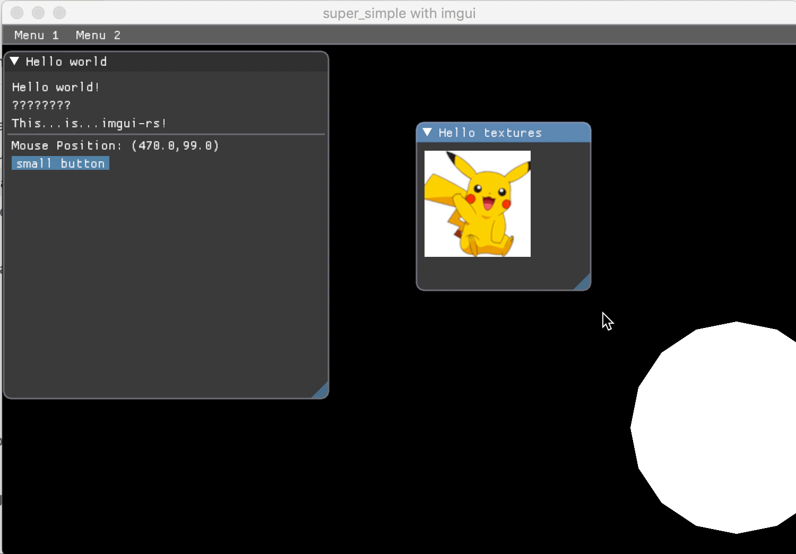

# imgui-ggez-starter 

## :dart: What is it?
This project does pretty much what it says on the tin, it adds imgui to a ggez starter sample. I spent quite a few hours digging through documentation and figuring this out so I am putting it here do you don't have to.



## :running: How to run it?
The usual cargo commands will do. 

```rust
// Building
cargo build

// Running 
cargo run

// Running in release
cargo run --release
```

## :muscle: Contributing
If you'd like to contribute and make this easier in any way feel free to:
1. Create an issue
1. Open a PR with an improvement or bug fix

## :car: License
MIT